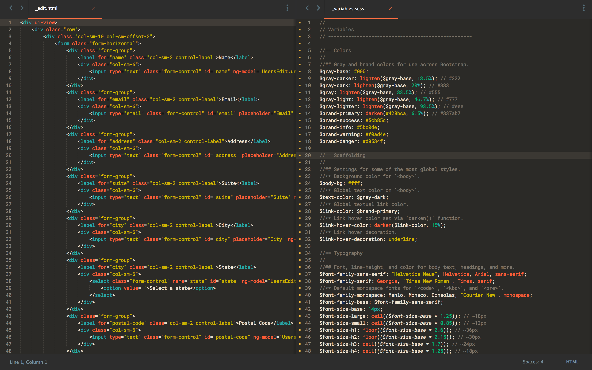
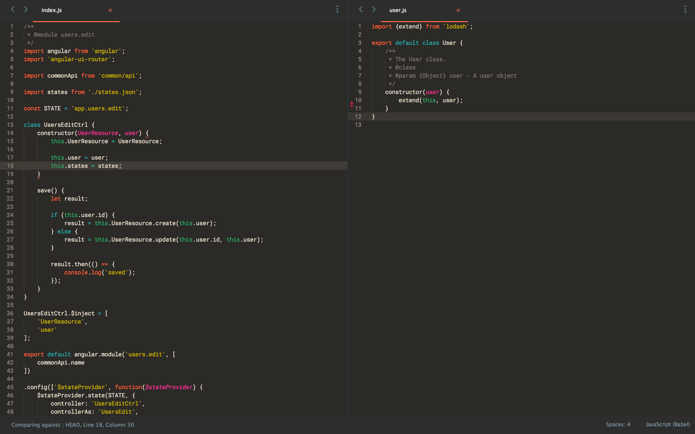
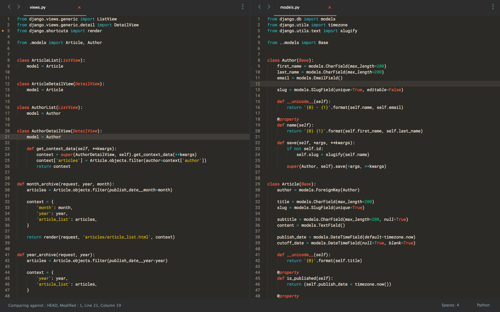

# Mandarin Peacock

## Credit

A fork of both [daylerees](https://github.com/daylerees/colour-schemes) Peacock theme and the [Mandarin syntax theme](https://github.com/jakedeichert/mandarin-syntax) for Atom.

## How to Install

### Via Package Control

The easiest way to install is using [Sublime Package Control](https://sublime.wbond.net), where Mandarin Peacock is listed as `Mandarin Peacock Color Scheme`.

1. Open Command Palette using menu item `Tools -> Command Palette...` (<kbd>⇧</kbd><kbd>⌘</kbd><kbd>P</kbd> on Mac)
2. Choose `Package Control: Install Package`
3. Find `Mandarin Peacock Color Scheme` and hit <kbd>Enter</kbd>

### Manual

You can also install the theme manually:

1. [Download the .zip](https://github.com/paradox41/mandarin-peacock/archive/master.zip)
2. Unzip and rename the folder to `Theme - Mandarin Peacock`
3. Copy the folder into `Packages` directory, which you can find using the menu item `Sublime Text -> Preferences -> Browse Packages...`

## Screenshots

### HTML and Sass

### JavaScript (using Babel)

### Python

